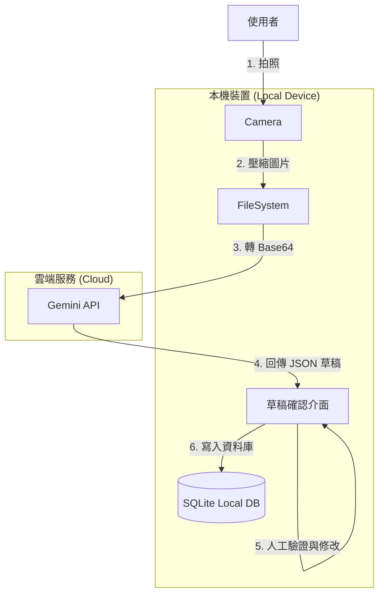

# AI Diet Planner - 懂吃的 AI 飲食紀錄助手


這是一個 **本地優先 (Local-First)**、由 **AI 驅動** 的飲食紀錄 App。我們堅持隱私優先，且不想讓你為了紀錄飲食而付昂貴的月費。


## 為什麼做這個 App？

建立飲食習慣很難，但現有的 App 往往讓事情變得更難：
1.  **手動輸入太痛苦**：每吃一餐都要搜尋「雞胸肉」、「白飯」，然後還要估算重量，太累了。
2.  **訂閱費用高昂**：想要 AI 拍照辨識功能？通常得付 $10美金/月 以上的訂閱費。

**AI Diet Planner** 採用 **Bring Your Own Key (BYOK)** 模式解決了這個問題。你只需要輸入自己的 Google Gemini API Key（免費額度就很夠用了），就能免費享受頂級的 AI 辨識服務。

## 核心特色

*   📸 **AI 拍照紀錄**：拍張照，等待 3 秒，獲得完整的營養素分析草稿。
*   🔒 **本地優先 (Local First)**：照片、紀錄、體重數據全存在你的手機裡。沒有伺服器監控，100% 隱私。
*   🔑 **BYOK 模式**：API Key 安全地儲存在裝置的 SecureStore 中，直接對連 Google，不經過第三方伺服器。
*   ⚡ **離線可用**：基於 SQLite 資料庫，即使在飛航模式也能查看與編輯紀錄。

## 技術棧 (Tech Stack)

*   **Framework**: [React Native](https://reactnative.dev/) (Expo SDK 50+)
*   **Database**: [SQLite](https://docs.expo.dev/versions/latest/sdk/sqlite/) + [Drizzle ORM](https://orm.drizzle.team/)
*   **Storage**: Expo FileSystem (圖片儲存) & SecureStore (金鑰儲存)
*   **AI**: Google Gemini API

## 系統架構



## 快速開始 (Getting Started)

1.  **下載專案**
    ```bash
    git clone https://github.com/yourusername/ai-diet-planner.git
    cd ai-diet-planner
    ```

2.  **安裝依賴**
    ```bash
    npm install
    ```

3.  **啟動 App**
    ```bash
    npx expo start
    ```

4.  **設定 AI**
    *   前往 [Google AI Studio](https://aistudio.google.com/) 取得免費的 API Key。
    *   在 App 設定頁面輸入 API Key。

## 相關文檔

*   [產品需求文檔 (PRD)](docs/prd_draft.md) - 詳細功能規格
*   [技術架構提案](docs/tech_arch_proposal.md) - 技術實作細節

## License

MIT
