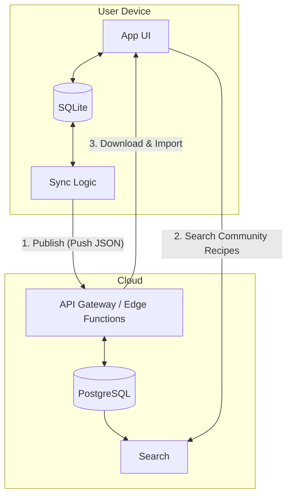

# Welcome to your Expo app 👋

This is an [Expo](https://expo.dev) project created with [`create-expo-app`](https://www.npmjs.com/package/create-expo-app).

## Get started

1. Install dependencies

   ```bash
   npm install
   ```

2. Start the app

   ```bash
   npx expo start
   ```

## Backend



## Reference

1. [How to Build ACTUALLY Beautiful Apps in 3 Prompts Using Cursor 2.0](https://www.youtube.com/watch?v=Be5IAxyxa6g) -- Build Initalize Design Component from scratch

2. [食品營養成分資料庫](https://consumer.fda.gov.tw/Food/TFND.aspx?nodeID=178)
