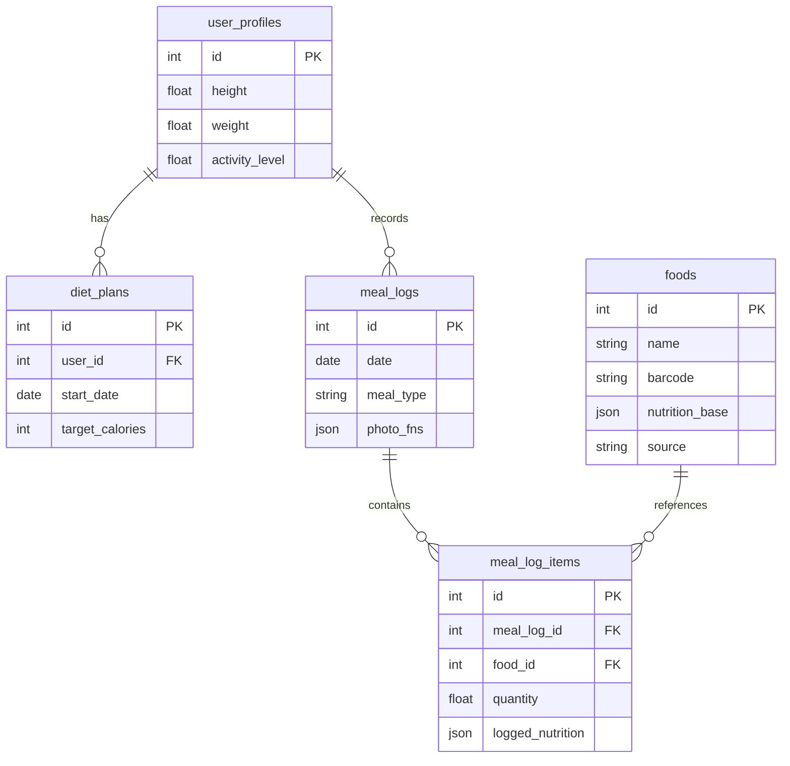

# Food Record App Product Requirements Document (PRD)

**Developer**: Sam (React)
**Status**: Draft (v2.1)

> 靈感來源：https://dribbble.com/shots/26454936-Health-Diet-App-Mobile-UI-UX

---

## 1. 產品概述 (Product Overview)

### 背景與痛點
建立飲食習慣需要持之以恆的紀錄，但現有解決方案存在兩大痛點：
1.  **手動輸入太痛苦**：如 Samsung Health 等傳統 App 操作繁瑣。
2.  **訂閱費用高昂**：支援 AI 自動掃描的服務（如 MyFitnessPal Premium）通常需要 $10~$30/月。

### 核心價值主張
提供一個 **「本地優先 (Local-First)」** 且 **「免訂閱費 (BYOK - Bring Your Own Key)」** 的 AI 飲食紀錄工具。使用者只需自備 Gemini API Key，即可享受 AI 自動辨識飲食的便利，同時確保數據完全私有。

### 關鍵目標 (Key Objectives)
1.  **本地優先 (Local First)**：所有資料（含圖片）儲存於手機端，無需連網也能查看紀錄，保護隱私且無伺服器成本。
2.  **BYOK AI 模式**：允許使用者輸入自己的 Gemini API Key，免去付費訂閱的負擔。
3.  **Human-in-the-loop 紀錄流程**：AI 輔助辨識 + 人工快速確認，平衡便利性與準確度。
4.  **簡易目標設定**：提供直觀的 TDEE 計算與營養素目標追蹤。

---

## 2. 使用者流程 (User Flows)

### 2.1 核心 AI 紀錄流程 (The AI Loop)
這是 App 的最核心體驗，旨在將紀錄時間縮短至 30 秒內。

1.  **影像擷取**：
    *   使用者點擊首頁 FAB -> 拍照或選圖。
    *   系統將圖片壓縮至 1024px 以下並轉 Base64。
2.  **AI 分析與草稿 (Draft Review)**：
    *   呼叫 Gemini API，回傳 JSON 格式的預估資料（含名稱、熱量、份量）。
    *   **介面**：顯示拍攝照片 + AI 辨識出的食物卡片清單。
3.  **人工驗證 (Human Verification)**：
    *   使用者檢視卡片：
        *   **準確**：直接保留。
        *   **份量有誤**：滑動調整份量（e.g. 1碗 -> 0.5碗）。
        *   **辨識錯誤**：刪除卡片或重選食物（搜尋本地 DB）。
4.  **確認與寫入**：
    *   點擊「確認紀錄」。
    *   系統將資料寫入 `MealLogs` (紀錄) 與 `Foods` (私有庫)，並更新今日攝取統計。

### 2.2 飲食計畫建立 (Onboarding)
1.  歡迎頁 (強調 Local First & AI)。
2.  輸入基本資料：性別、生日、身高、體重、活動量。
3.  設定目標：減重/維持/增重 (設定每週目標速度)。
4.  系統計算 TDEE 並建立第一份 `DietPlan`。

### 2.3 手動紀錄 (Fallback)
1.  **搜尋**：支援模糊搜尋本地 `Foods` 資料庫。
2.  **掃描條碼**：掃描包裝食品 Barcode (EAN-13) -> 查詢本地 DB。

---

## 3. 資料架構 (Data Schema)

### A. 使用者與計畫 (User & Plan)
**`user_profiles`** (單一使用者狀態)
| Field | Type | Description |
| :--- | :--- | :--- |
| `id` | PK | |
| `height`, `weight` | float | cm, kg |
| `gender` | enum | 'male', 'female' |
| `activity_level` | enum | 1.2 ~ 1.9 (TDEE Factor) |

**`diet_plans`** (階段性目標)
| Field | Type | Description |
| :--- | :--- | :--- |
| `id` | PK | |
| `user_id` | FK | |
| `start_date` | date | |
| `target_calories` | int | 每日熱量目標 (e.g. 2000) |
| `target_macros` | json | `{protein: 150, carbs: 200, fat: 60}` |
| `status` | enum | 'active', 'archived' |

### B. 食物資料庫 (Food Library)
**`foods`** (所有可食用項目)
| Field | Type | Description |
| :--- | :--- | :--- |
| `id` | PK | |
| `name` | string | 食物名稱 (index) |
| `brand` | string | 品牌 (Optional) |
| `barcode` | string | EAN-13 (index) |
| `nutrition_base` | json | `{calories, protein, carbs, fat}` (per unit) |
| `serving_unit` | string | e.g. "g", "ml", "serving" |
| `source` | enum | 'system', 'user', 'ai' |

### C. 飲食紀錄 (Daily Tracking)
**`meal_logs`** (一餐事件)
| Field | Type | Description |
| :--- | :--- | :--- |
| `id` | PK | |
| `date` | date | YYYY-MM-DD (index) |
| `type` | enum | 'breakfast', 'lunch', 'dinner', 'snack' |
| `photo_fns` | json | 圖片檔名陣列 `["files/a.jpg"]` |

**`meal_log_items`** (紀錄明細 & Snapshot)
| Field | Type | Description |
| :--- | :--- | :--- |
| `id` | PK | |
| `meal_log_id` | FK | |
| `food_id` | FK | 關聯到原始食物 |
| `quantity` | float | 份量倍數 (e.g. 1.5) |
| `logged_nutrition` | json | **Snapshot**: 紀錄當下的營養總值 |

---

## 4. 導航與資料流 (Navigation & Data Flow)

### 4.1 導航結構 (Navigation Hierarchy)
採用標準 Bottom Tab + Stack 混合架構。

*   **Root Stack**
    *   `Onboarding` (Wizard): 首次開啟時引導設定個人資料與目標。
    *   **Main Tab Navigator**
        *   **Home (Dashboard)**:
            *   今日儀表板 (圓環進度條)。
            *   時間軸 (早餐/午餐 卡片)。
            *   FAB (Floating Action Button) -> 開啟 Camera/Input。
        *   **Stats (Analysis)**:
            *   體重趨勢圖 (Line Chart)。
            *   近期營養攝取分析 (Bar Chart)。
        *   **Settings**:
            *   User Profile 編輯。
            *   API Key 設定 (Secure Input)。
            *   Data Export/Backup。
    *   **Record Stack** (Modal Presentation):
        *   `CameraScreen`: 拍照介面。
        *   `EditDraftScreen`: AI 辨識結果預覽與確認頁。
        *   `FoodSearchScreen`: 手動搜尋頁。

### 4.2 資料流邏輯 (Data Flow)
**Core Logic: Unidirectional Data Flow** (類似 Redux/React Query 概念)

1.  **Read Flow (讀取)**:
    *   `React Component` 訂閱 `Live Query` (via Drizzle/Observable)。
    *   當 DB 資料變更時，UI 自動重新渲染 (Auto-refresh)。
    *   *Dashboard* 直接計算今日 `MealLogs` 的總和，不需額外儲存 "TodayTotal"。

2.  **Write Flow - AI Path (寫入)**:
    *   `Camera` -> 取得圖片 -> 壓縮。
    *   `Service` 呼叫 Gemini API -> 回傳 JSON Data (Transient State)。
    *   `UI` 顯示 Draft List (In-Memory State)。
    *   User 確認 -> `Transaction` 寫入 SQLite (`MealLogs` + `Foods` + `Items`)。

3.  **Write Flow - Manual Path**:
    *   `Search` -> 查詢 SQLite FTS (Full Text Search)。
    *   User 選擇 -> `Transaction` 寫入。

---

## 5. 技術架構 (Technical Architecture)

### 5.1 技術棧
*   **Framework**: React Native (Expo SDK 50+).
*   **Database**: **SQLite** (via `expo-sqlite`) + **Drizzle ORM** (Type-safe SQL).
*   **Security**: **Expo SecureStore** (用於安全儲存使用者 API Key)。

### 5.2 圖片儲存策略
*   **位置**: `FileSystem.documentDirectory + 'meal_photos/'`.
*   **壓縮**: Max 1024px, Quality 0.7, WebP/JPEG (<300KB/張)。
*   **DB**: 僅存檔名 UUID。

### 5.3 離線備份
*   提供「匯出 JSON + 圖片包」功能，不實作自動雲端同步。
